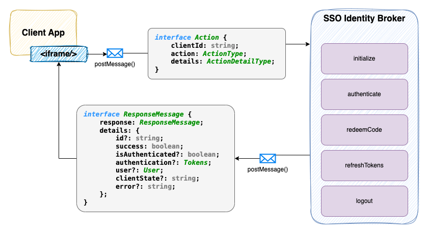

# Cognito Identity Broker Web 

These are web applications for the Cognito Identity Broker project. The Cognito API stack can be found here:
[Cognito Identity Broker](https://github.com/jasonatepaint/cognito-identity-broker)

This repo is broken into 2 React web apps. Both applications utilize the [cognito-sso-client](https://github.com/jasonatepaint/cognito-sso-client)
client library to facilitate the authentication process.

#### 1. [SSO Broker](sso-broker) -- The identity broker app allows single sign (SSO) and communicates with the [Cognito identity broker](https://github.com/jasonatepaint/cognito-identity-broker) API.

#### 2. [Client App](client-app) -- An example client application that communicates with the **SSO Broker** using the [cognito-sso-client](https://github.com/jasonatepaint/cognito-sso-client) library.

## Getting Started

* Deploy the [Cognito Identity Broker](https://github.com/jasonatepaint/cognito-identity-broker/blob/master/README.md#setup) stack
* Run the [SSO Broker](sso-broker/README.md#setup) 
* Run the [Client App](client-app/README.md#setup)
* Navigate to the client application: `http://localhost:3001`. This will start the authorization code flow process.
  
   Your first visit will result in a redirect to the SSO Broker `http://localhost:3000`. The redirected URL will have a long querystring which informs
   the broker how to process the request. It will include the following attributes:
     - `clientId` -- The client app's unique ID
     - `redirectUri` -- The registered redirectUri for the client app. This is where the broker will redirect back
     - `codeChallenge` -- A calculated hash value that will be later used to verify the code flow process when the client exchanges the `code` for tokens
     - `state` -- This will be a Base64 encoded JSON string of anything the client wants to pass along (including a `referrer` url, which is automatically added)

## The Authorization Code Flow Process
The client application uses this process to authenticate the user. The [cognito-sso-client](https://github.com/jasonatepaint/cognito-sso-client) library handles 99% of this process for the client app. See the [Client App README](client-app/README.md#how-it-works) for more details. 

_There are 3 high-level steps:_

1. The client app calls the `authenticate` client library action which redirects the user to the broker with `clientId`, `redirectUri`, `codeChallenge`, and `state`.
2. A 302 redirect is triggered from the broker back to the client with the `code` on the querystring.
3. The client app retrieves the `code`, the original `codeVerifier` (used to create the `codeChallenge`), and calls the broker to exchange the code for tokens.
   

