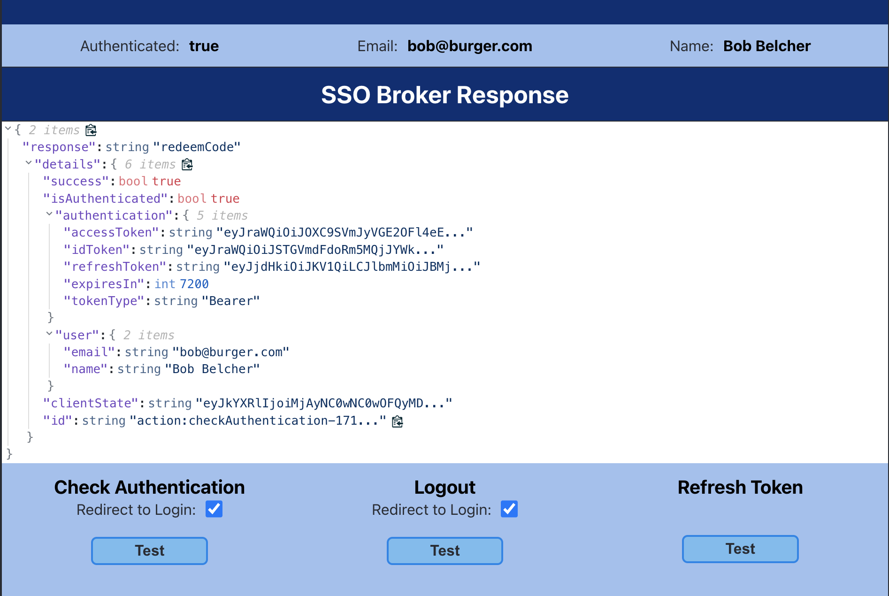

# Client Application
This example client application illustrates the authentication processes which utilizes the
[cognito-sso-client](https://github.com/jasonatepaint/cognito-sso-client) client library.
Between the SSO Broker and the SSO client library, this approach removes 99% of the work required to 
implement the functionality of a complete authentication system.

### Prerequisites
* [Cognito Identity Broker](https://github.com/jasonatepaint/cognito-identity-broker)

## Setup
1. Copy `.env.template` to `.env` and set the following values:
    - `VITE_CLIENT_ID` - This will be your Cognito Client Application for `Client 1` 
2. Run the following commands to start the dev server
   ```shell
   npm install
   npm run dev
   ```
3. Start the [SSO Broker](../sso-broker) App
4. Navigate to the Client App:  `http://localhost:3001`

   Your first visit will result in a redirect to the SSO Broker `http://localhost:3000`. The redirected URL will have a long querystring which informs the broker how to process the request. It will include the following attributes:
     - `clientId` -- The client app's unique ID
     - `redirectUri` -- The registered redirectUri for the client app. This is where the broker will redirect back
     - `codeChallenge` -- A calculated hash value that will be later used to verify the code flow process when the client exchanges the `code` for tokens
     - `state` -- This will be a Base64 encoded JSON string of anything the client wants to pass along (including a `referrer` url, which is automatically added)

---

## Using the Client App
The purpose of this example app is to demonstrate how the [Cognito Identity Broker](https://github.com/jasonatepaint/cognito-identity-broker) API, the [SSO Broker](../sso-broker) App, and the [SSO Client Library](https://github.com/jasonatepaint/cognito-sso-client) work in coordination to facilitate the client application authentication process.

The app can be used to test the following functions:

* **_Authenticate_** -- checks with the SSO Broker and authenticates.
* **_Logout_** -- Logs the user out of both the Client and the SSO Broker. If `Redirect to Login` is checked, the user will be redirected to the broker to login again.
* **_Refresh Tokens_** -- This uses the user's `refreshToken` on the client app to request new `id` and `access` tokens. 




---

## How it works
The application requires very limited coding to implement the authentication process. All of the required code
exists in [App.tsx](src/App.tsx). 

#### The main parts include:
1. Adding an iframe to the html.
2. Initializing the client library
3. Registering a callback for responses from the broker
4. Responding to responses from the broker.

##### The special sauce
Most of the magic happens via the SSO client library and an invisible `<iframe>`. 
To allow a secure communication channel between the client application and the sso broker, an invisible `<iframe>` is 
placed in the client application. Once loaded, the client and broker communicate via 
[window.postMessage()](https://developer.mozilla.org/en-US/docs/Web/API/Window/postMessage) protocol.

```typescript jsx
<iframe
    style={{ display: "none" }}
    ref={authFrameRef}
    id="authFrame"
    sandbox="allow-same-origin allow-scripts"
    src={BROKER_CLIENT_URL}
></iframe>
```

Once the client library is initialized, the application will attempt to authenticate with the broker causing
a hard redirect to the broker to start the authentication process.
