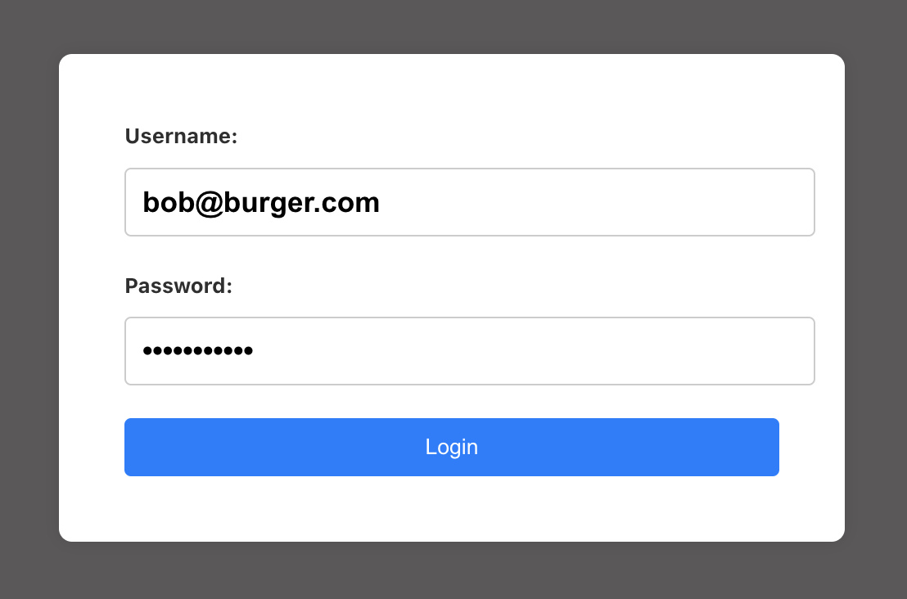

# Cognito SSO Broker
This is a basic identity broker web app that illustrates single sign on (SSO) via the 
Authorization Code Flow process.

### Prerequisites
* [Cognito Identity Broker](https://github.com/jasonatepaint/cognito-identity-broker)

## Setup
1. Copy `.env.template` to `.env` and set the following values:
    - `VITE_AUTH_API_URL` - This will be the API url (`apiUrl`)
    - `VITE_CLIENT_ID` - This will be your Cognito Client Application for `SSO Broker`
    - (Optional) - These are just for auto-fill for quick testing
      - `VITE_USERNAME` - A valid username (email) in Cognito.
      - `VITE_PASSWORD` - The password for the user.
2. Run the following commands to start the dev server
   ```shell
   npm install
   npm run dev
   ```

## How it works

This Broker application has 2 main functions. Its first is to facilitate user interactions 
(e.g. login, MFA, Password reset, etc) and secondly as a communication channel that allows 
client applications to authenticate the user via an Authorization Code Flow process.

* ### User Interactions -- `http://localhost:3000`
  * Simple `username/password` form for processing a login request.
    
* ### Client Communication Service -- `http://localhost:3000/client/`
  * `initilize` -- Initializes and configures the client application
  * `authenticate` -- Determines the user's current authentication and starts the code flow process, passing back a `code` the client application will exchange for tokens.
  * `redeemCode` -- Processes a client app's `code` and `codeVerifier` and returns tokens, if successful.
  * `logout` -- Logs the user out of the client app (and the SSO Broker if requested).
  * `refreshTokens` -- Updates the user's `idToken` and `accessToken` if their `refreshToken` is still valid


#### Project Notes:
* This example uses a `username/password` approach for login. This is to keep this example focused on the broker concept. The preferred approach would be using **SRP** [(Secure Remote Password)](https://docs.aws.amazon.com/cognito/latest/developerguide/amazon-cognito-user-pools-authentication-flow.html#Using-SRP-password-verification-in-custom-authentication-flow).
* API calls are made thru the Vite dev server [vite.config.ts](vite.config.ts) with a `proxy` configuration. So if you 
  deploy to another web server, you will need to account for this. 
  ```javascript
  {
      proxy: {
          "/auth": {
              target: AUTH_API_URL, 
              changeOrigin: true
          }
      }
  }
  ```
